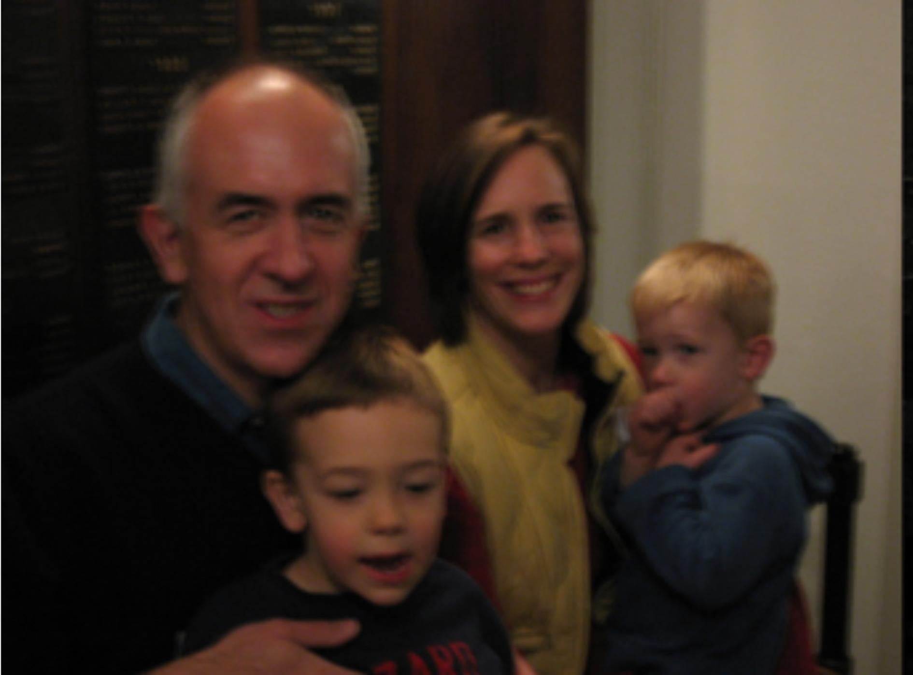
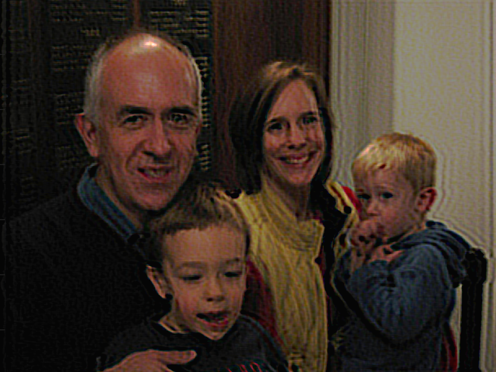
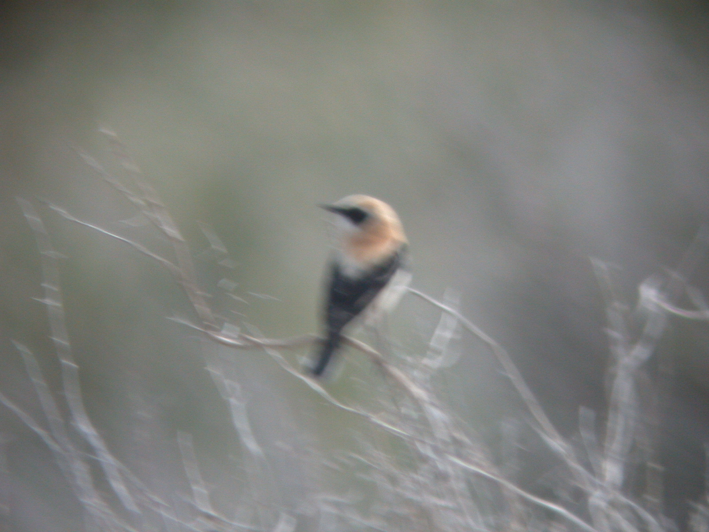
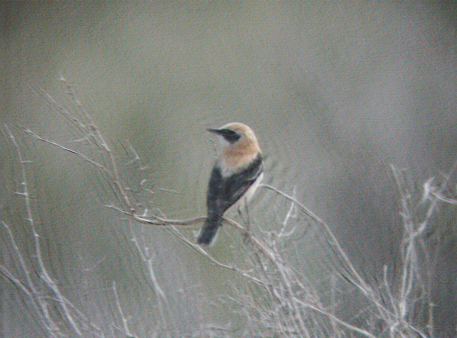
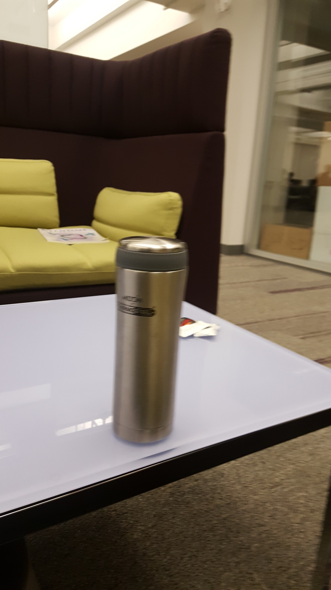
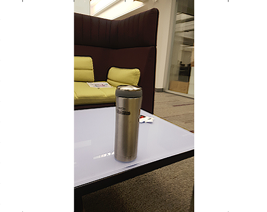

# Blind-deconvolution

Blind Deconvolution is a proces which unblurs an image using an unknown blur kernel. Much of my work relates to this [paper](https://cs.nyu.edu/~fergus/papers/deblur_fergus.pdf) by Rob Fergus. 

To extract the sharpened image, we first need to compute the blur kernel. The latter is estimated using Maximum a posteriori (MAP) algorithm, while assuming an exponential prior distribution for the blur kernel values. Ideally, the posterior distribution is first computed after which MAP algorithm is used. 

After estimating the Blur kernel, Richardson Lucy algorithm (a non blind deconvolution) algorithm is used to get the pixel values for the final sharpened image. A detailed explanation of the algorithm is given in my [final paper](https://drive.google.com/file/d/1jS9_9HLsTxP52-DqRaqLdmpyBjP_aiC7/view). 

Few results are shown below:

  
  

  
  

You can also sharpen a part of the image by just selecting that particular image area and throwing it as an input to the algorithm. For example, consider the below blurred image and its result. Here, I am just trying to sharpen the bottle and not the backgorund.

  
  

# Steps to run the code on any blurred image:

- Copy your blurred image into images/ (e.g. ian1.jpg)
- Make a copy of one of the example image scripts in results/ (e.g. ’cp ian1.m ian1.m’ if you are using Linux)
- Edit new image script (e.g. ian1.m), changing the following settings: - obs_im to reflect new file name (e.g. obs_im = ’../images/ian1.jpg’;) - AXIS to reflect the area of the image to use for inference. You may want to load up in the image in Matlab, display it and zoom in to find a suitable region. You can get the current axis limits with the command ’round(axis)’. Cut’n’paste the values into the AXIS setting. - Set BLUR_KERNEL_SIZE by finding a blurred edge somewhere in the image and estimating the size of the blur. Always be generous - its better to give a larger value than a smaller one. Minimum sensible values would be around 11 or so. Max. sensible values 50-60 or so. - Set initial orientation (FIRST_INIT_MODE_BLUR) by examining the rough direction of the blur in the image (horizontal or vertical). This one isn’t too important. If you’re not sure, you can specify a delta function. - If the image is very large you might want to reduce it by setting PRESCALE to be less than 1.
- Run the image script at your Matlab prompt (e.g. ’ian1’), while in the results/ subdirectory. This should generate ian1.mat
- Run main inference algorithm with ’deblur(<script_name>)’, e.g. ’deblur(’ian1’)’
- Check on progress as it runs by examining the tmp_<script_name>.mat file using ’plotgray(<script_name>)’ e.g. ’plotgray(’ian1’)’. [Note: plotgray.m is in the same directory as deblur.m]
- When it has finished the final results may be viewed with the same ’plotgray(<script_name>)’
command. If called with an additional flag parameter (’plotgray(<script_name>,1)’) it will
save the kernel and deblurred image out to disk
